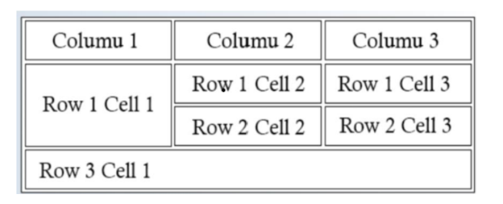

# Lab Cycle – Experiment 2

## Aim:

Design a webpage using HTML that:

1. Creates a table with three columns: **Column 1**, **Column 2**, **Column 3**.
2. Adds sample data for three rows with a merged cell using `rowspan` and `colspan`, similar to the reference layout.
3. Uses inline CSS to add borders to the table and cells and center-align all text inside the table.


***

***

## Source Code

```html
<!DOCTYPE html>
<html lang="en">
<head>
    <meta charset="UTF-8">
    <meta name="viewport" content="width=device-width, initial-scale=1.0">
    <title>Table Layout Example</title>
    <style>
        td {
            padding: 20px;
        }
    </style>
</head>
<body>

<table border="2" width="50%" style="text-align:center;">
    <tr>
        <th>Column 1</th>
        <th>Column 2</th>
        <th>Column 3</th>
    </tr>

    <tr>
        <td rowspan="2">Row 1 Cell 1</td>
        <td>Row 1 Cell 2</td>
        <td>Row 1 Cell 3</td>
    </tr>

    <tr>
        <td>Row 2 Cell 2</td>
        <td>Row 2 Cell 3</td>
    </tr>

    <tr>
        <td colspan="3">Row 3 Cell 1</td>
    </tr>
</table>

</body>
</html>
```


***

## Explanation

```
- The `border="2"` attribute on the `<table>` tag and the default border behavior on `<th>`/`<td>` elements give visible borders to the table and its cells.  
```

- The inline style `style="text-align:center;"` on the `<table>` centers all text inside the table cells, while `rowspan` and `colspan` merge cells to match the reference structure.
<span style="display:none">[^1]</span>

<div align="center">⁂</div>

[^1]: image.jpg

