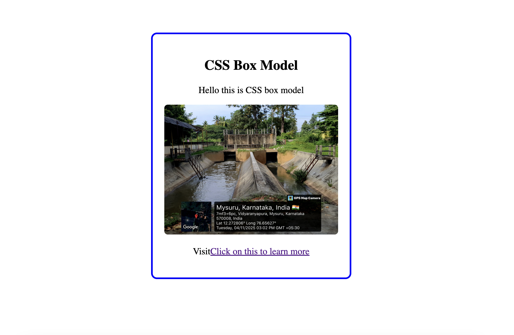

# Lab Cycle – Experiment 3

## Aim:

Create a visually appealing webpage that demonstrates the **CSS box model** by styling a `<div>` element with padding, margins, and borders, and include an image and a hyperlink inside the box.

***

***

## Source Code

```html
<!DOCTYPE html>
<html lang="en">
<head>
    <meta charset="UTF-8">
    <meta name="viewport" content="width=device-width, initial-scale=1.0">
    <title>CSS Box Model Demo</title>
    <style>
        body {
            text-align: center;
            padding: 40px;
        }

        .box {
            background-color: white;
            width: 300px;
            padding: 20px;          /* Inner spacing (padding) */
            margin: 30px auto;       /* Outer spacing (margin) and centering */
            border: 3px solid blue;  /* Border around the box */
            border-radius: 10px;
        }

        img {
            width: 100%;
            border-radius: 6px;
        }
    </style>
</head>
<body>
    <div class="box">
        <h2>CSS Box Model</h2>
        <p>Hello this is CSS box model</p>
        
        <p>
            Visit
            <a href="https://nie.ac.in" target="_blank">
                Click on this to learn more
            </a>
        </p>
    </div>
</body>
</html>
```


***


## Output

---
## Explanation

- The `.box` `<div>` demonstrates the **box model**: `width`, `padding` (inside spacing), `border`, and `margin` (outside spacing) are all applied, with `margin: 30px auto` centering the box horizontally.
- An image is placed inside the box and styled to take full width of the container, and a hyperlink is included within a paragraph to provide navigation to an external site, enhancing the layout visually.
---
