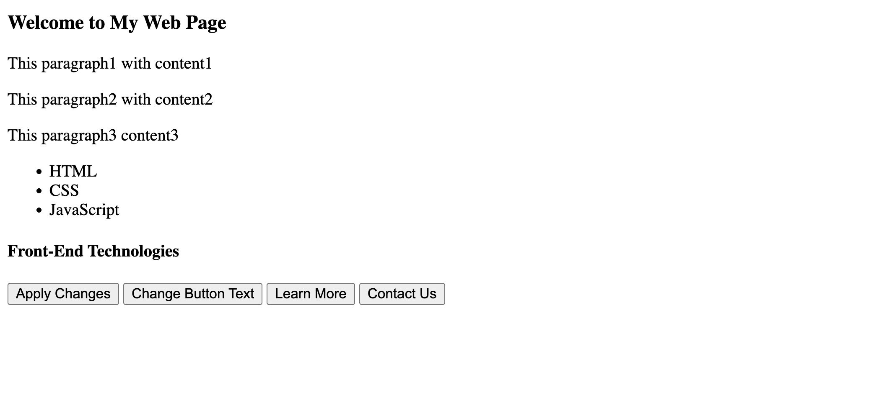
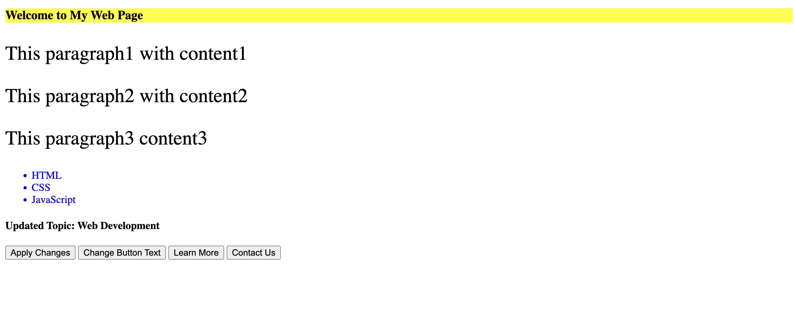
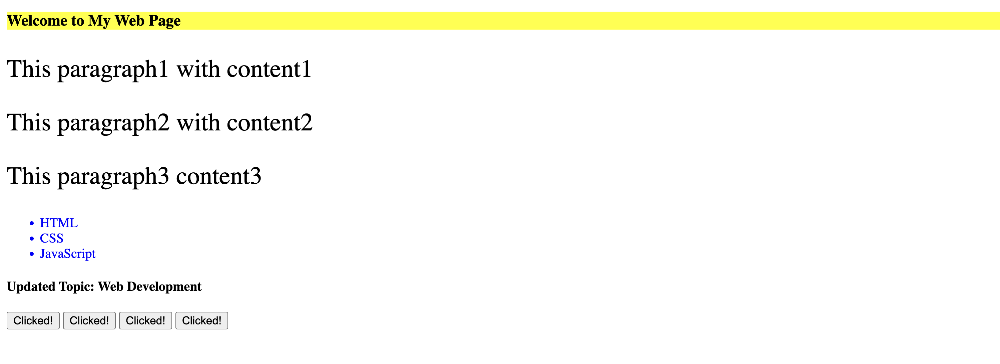

# Lab Cycle - Experiment 7

## Aim:
Create an HTML page with a list of items, a few buttons, and some paragraphs.  
Write a JavaScript program to perform the following DOM manipulations:
1. Change the background color of an element by its ID.  
2. Change the text color of all list items (`<li>`) to blue.  
3. Change the text of all buttons to `"Clicked!"` when clicked.  
4. Increase the font size of all paragraphs.  
5. Select the first element with a specific class and change its text.

---

## HTML & JavaScript Code:

```html
<!DOCTYPE html>
<html lang="en">
<head>
    <meta charset="UTF-8">
    <meta name="viewport" content="width=device-width, initial-scale=1.0">
    <title>JavaScript DOM Manipulation Example</title>
</head>
<body>
    <h3 id="mainHeading">Welcome to My Web Page</h3>

    <p>This paragraph1 with content1</p>
    <p>This paragraph2 with content2</p>
    <p>This paragraph3 content3</p>

    <ul>
        <li>HTML</li>
        <li>CSS</li>
        <li>JavaScript</li>
    </ul>

    <h4 class="topicHeading">Front-End Technologies</h4>

    <button onclick="applyChanges()">Apply Changes</button>
    <button onclick="changeAllButtons()">Change Button Text</button>
    <button>Learn More</button>
    <button>Contact Us</button>

    <script>
        function applyChanges() {
            // a) Change the background color of an element by its ID
            let mainHeading = document.getElementById("mainHeading");
            mainHeading.style.backgroundColor = "yellow";

            // b) Change the text color of all list items (<li>) to blue
            let listItems = document.querySelectorAll("li");
            listItems.forEach(item => item.style.color = "blue");

            // d) Increase the font size of all paragraphs
            let paragraphs = document.getElementsByTagName("p");
            for (let i = 0; i < paragraphs.length; i++) {
                paragraphs[i].style.fontSize = "30px";
            }

            // e) Select the first element with a specific class and change its text
            let firstTopicHeading = document.querySelector(".topicHeading");
            firstTopicHeading.textContent = "Updated Topic: Web Development";
        }

        function changeAllButtons() {
            // c) Change the text of all buttons to "Clicked!"
            let allButtons = document.querySelectorAll("button");
            allButtons.forEach(button => button.textContent = "Clicked!");
        }
    </script>
</body>
</html>

```
---

## Output:

### 🖼️ Initial Screen:
Before performing any actions — the page loads with normal paragraphs, list items, and default button text.

---



---

When the **"Apply Changes"** button is clicked:
- The background color of the main heading (`<h3>`) changes to **yellow**.  
- All list items (`<li>`) — HTML, CSS, JavaScript — change their text color to **blue**.  
- All paragraphs’ font size increases.  
- The first element with class `.topicHeading` updates its text to **“Updated Topic: Web Development.”**



---

When the **"Change Button Text"** button is clicked:
- All buttons on the page change their text to **“Clicked!”**.



---

## Explanation:

### a) `getElementById()`
- Used to **select an element by its unique ID**.  
- In this program, it selects the `<h3>` element and changes its background color.

### b) `querySelectorAll()`
- Returns **all matching elements** for a given CSS selector.  
- Used here to select all `<li>` elements and apply the color change to each.

### c) `getElementsByTagName()`
- Returns a **live HTMLCollection** of all elements with a given tag name.  
- Since it doesn’t support `.forEach()`, a `for` loop is used to change all paragraph font sizes.

### d) `querySelector()`
- Returns **the first matching element** of a specified selector.  
- Used here to select the first element with the class `.topicHeading` and change its text.

### e) `textContent`
- Updates or retrieves the **text content** of an HTML element.  
- Safer than `innerHTML` because it doesn’t interpret HTML tags.

### f) `forEach()` Loop
- Used to iterate over **NodeLists** (like those returned by `querySelectorAll`)  
  to apply the same change to multiple elements.

---

## Viva Questions:

1. **What is the difference between `getElementById()` and `querySelector()`?**  
   - `getElementById()` only works with IDs.  
   - `querySelector()` can use **any CSS selector** (like `#id`, `.class`, or `tag`).

2. **What is the use of `querySelectorAll()`?**  
   - It selects **all matching elements** and returns a NodeList, allowing bulk operations.

3. **Why is a `for` loop used with `getElementsByTagName()`?**  
   - Because it returns an **HTMLCollection**, which doesn’t support `.forEach()` directly.

4. **What is the difference between `innerHTML` and `textContent`?**  
   - `innerHTML` parses HTML tags inside the element.  
   - `textContent` only sets or gets **plain text**.

5. **What is DOM manipulation?**  
   - It means **accessing and modifying HTML elements** dynamically using JavaScript.

6. **Why do we use event attributes like `onclick`?**  
   - To trigger JavaScript functions when the user interacts with an element (like clicking a button).

---

## Note:
- `getElementById()` → Single element (by ID).  
- `querySelector()` → First element matching the selector.  
- `querySelectorAll()` → All elements matching the selector.  
- `getElementsByTagName()` → Collection of elements by tag name.  
- `textContent` → Safe for plain text updates.  

---

## Conclusion:
This experiment demonstrates how to **manipulate HTML elements dynamically** using JavaScript’s DOM methods.  
You can access elements by ID, class, or tag name and change their appearance or content through event-driven functions.

