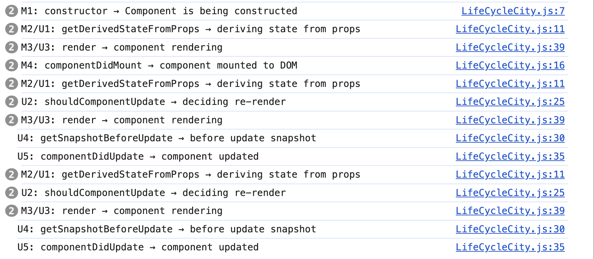

# Lab Cycle - Experiment 8

## Aim:

Demonstrate all the React class component lifecycle methods during the **mounting** and **updating** phases by changing the city name from **“Mysore”** to **“Bangalore”** after 2 seconds and display the change.

***

## Source Code

### LifeCycleCity.js

```javascript
import React, { Component } from 'react';

class LifeCycleCity extends Component {
  constructor(props) {
    super(props);
    this.state = { city: "Mysore" };
    console.log("M1: constructor → Component is being constructed");
  }

  static getDerivedStateFromProps(props, state) {
    console.log("M2/U1: getDerivedStateFromProps → deriving state from props");
    return null;
  }

  componentDidMount() {
    console.log("M4: componentDidMount → component mounted to DOM");

    // Change city after 2 seconds
    setTimeout(() => {
      this.setState({ city: "Bangalore" });
    }, 2000);
  }

  shouldComponentUpdate(nextProps, nextState) {
    console.log("U2: shouldComponentUpdate → deciding re-render");
    return true;
  }

  getSnapshotBeforeUpdate(prevProps, prevState) {
    console.log("U4: getSnapshotBeforeUpdate → before update snapshot");
    return null;
  }

  componentDidUpdate(prevProps, prevState) {
    console.log("U5: componentDidUpdate → component updated");
  }

  render() {
    console.log("M3/U3: render → component rendering");
    return (
      <div>
        <h2>React Lifecycle Demo</h2>
        <h1>City: {this.state.city}</h1>
      </div>
    );
  }
}

export default LifeCycleCity;
```


***

### App.js

```javascript
import React from 'react';
import LifeCycleCity from './LifeCycleCity';

function App() {
  return (
    <div>
      <LifeCycleCity />
    </div>
  );
}

export default App;
```


***

## Output and Behavior

### Initial Render

- Displays:

``` 
City: Mysore 
```

- Console logs lifecycle methods called during mounting:
    - `constructor` (M1)
    - `getDerivedStateFromProps` (M2)
    - `render` (M3)
    - `componentDidMount` (M4)

***


### After 2 Seconds

- The city changes to **Bangalore** via `setState` in `componentDidMount`.
- This triggers the update lifecycle:
    - `getDerivedStateFromProps` (U1)
    - `shouldComponentUpdate` (U2)
    - `render` (U3)
    - `getSnapshotBeforeUpdate` (U4)
    - `componentDidUpdate` (U5)
- The displayed city updates to:

``` 
City: Bangalore 
```


### Console




***

## Explanation of Lifecycle Methods

### Mounting Phase

- **constructor (M1):** Initializes state and props.
- **getDerivedStateFromProps (M2):** Syncs state to props before rendering.
- **render (M3):** Returns the React element to be displayed.
- **componentDidMount (M4):** Runs after the component mounts; here it triggers the city change after 2 seconds.


### Updating Phase (After State Change)

- **getDerivedStateFromProps (U1):** Checks if state should update from props.
- **shouldComponentUpdate (U2):** Decides if re-rendering is necessary; always returns `true` here.
- **render (U3):** Renders the updated output.
- **getSnapshotBeforeUpdate (U4):** Captures some state/DOM info before the update.
- **componentDidUpdate (U5):** Runs after the update completes.

***

## Viva Questions

1. **What are React lifecycle methods?**
    - Methods that run at specific points in a component’s life for mounting, updating, and unmounting.
2. **When is `componentDidMount` called?**
    - After the component is rendered to the DOM the first time.
3. **What is `shouldComponentUpdate` used for?**
    - To optimize rendering by controlling if the component should re-render.
4. **Why use `getSnapshotBeforeUpdate`?**
    - To capture information before the DOM updates, e.g., scroll position.
5. **What triggers the updating lifecycle?**
    - Changes in props or state.

***

## Note:

- `getDerivedStateFromProps` is static and can be used for syncing state.
- Logging lifecycle method names helps to understand React’s update flow.
- Make sure to return the correct value in `shouldComponentUpdate` to avoid unnecessary renders.

***

## Conclusion:

This experiment demonstrates the full mounting and updating lifecycle methods in a React class component by changing the city state after 2 seconds and observing lifecycle method calls and UI changes dynamically.

***
