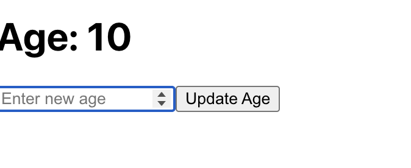
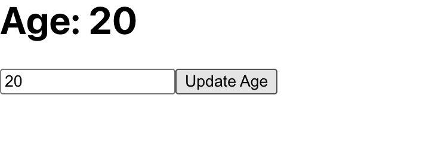

# Lab Cycle - Experiment 10

## Aim:

Implement a **React functional component** that:

1. Accepts an `age` prop and displays it inside an `<h1>`.
2. Includes an input field and a button that allows the user to **update the age** in the heading using a state variable (**useState** \& **useEffect**).

***

## Source Code

### ReactHookie.js

```javascript
import React, { useState, useEffect } from 'react';

function ReactHookie({ age }) {
  const [currentAge, setCurrentAge] = useState(age);
  const [newAge, setNewAge] = useState("");

  useEffect(() => {
    console.log("Age updated:", currentAge);
  }, [currentAge]);

  return (
    <div>
      <h1>Age: {currentAge}</h1>
      <input 
        type="number" 
        value={newAge} 
        onChange={(e) => setNewAge(e.target.value)}
        placeholder="Enter new age"
      />
      <button onClick={() => setCurrentAge(newAge)}>
        Update Age
      </button>
    </div>
  );
}

export default ReactHookie;
```


***

### App.js

```javascript
import React from 'react';
import ReactHookie from './Lab_pro/ReactHookie';

function App() {
  return (
    <div>
      <ReactHookie age={10} />
    </div>
  );
}

export default App;
```


***

## Output

### 🖼️ Initial Render

- The page displays:
`Age: 10`
with an input field and a button.

***




### 🔄 User Interaction

- When the user types a new value (e.g., `21`) into the input field and clicks **Update Age**:
    - The heading updates to show: `Age: 21`
    - The new age is logged to the console (`Age updated: 21`).

***

## Explanation

### a) useState

- **useState** is used to create state variables in functional components.
- `currentAge` stores the current displayed age.
- `newAge` holds the value entered in the input field.


### b) useEffect

- **useEffect** allows side effects — here, it logs the updated age to the console each time `currentAge` changes.


### c) Handling Input and Events

- The input field is controlled by `newAge`.
- Whenever the input changes, `setNewAge` updates the value.
- Clicking the button runs `setCurrentAge(newAge)`, updating the displayed age and triggering the useEffect.


### d) Props and State

- The initial age is set via the `age` prop passed from the parent (`App.js`).
- State (`currentAge`) is independent and can be updated by user actions.

***

## Viva Questions

1. **What is the difference between props and state in React?**
    - **Props** are read-only and passed from parent to child component, while **state** is managed inside the component and can change over time.
2. **How does useState work?**
    - It declares a state variable and a function to update it inside a functional component.
3. **What is useEffect, and when is it used?**
    - `useEffect` lets you perform side effects (like logging, API calls, etc.) after render or when certain state/props update.
4. **Why use controlled components for forms in React?**
    - Controlled components tie form inputs to state, making it easier to manage, validate, and update.
5. **What is the purpose of using keys in lists in React?**
    - Keys help React efficiently update and render lists by uniquely identifying each item.

***

## Note:

- Always use **state** for data that changes and needs to be displayed or used in logic.
- **Props** should not be directly mutated.
- `useEffect` runs after rendering and can depend on specific values.

***

## Conclusion

This experiment shows how to build a simple interactive form in React using state hooks (`useState`) to manage user input, effect hooks (`useEffect`) to handle side effects, and props to pass initial values from parent to child. Such patterns are foundational to modern React app development.

***

**References:**
(React docs \& learning resources)

***

**You may copy **this report structure** for your lab record for clarity and completeness in academic submissions.**

