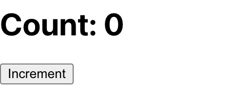
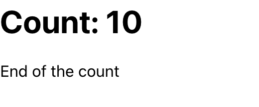

# Lab Cycle - Experiment 12

## Aim:

Write a React functional component to create a counter that increments by one on each button click and displays the message **"End of the count"** when the count reaches 10.

***

## Source Code

### Counter.js

```javascript
import React, { useState } from 'react';

function Counter() {
  const [count, setCount] = useState(0);

  const handleIncrement = () => {
    if (count < 10) {
      setCount(count + 1);
    }
  };

  return (
    <div>
      <h1>Count: {count}</h1>
      {count < 10 ? (
        <button onClick={handleIncrement}>Increment</button>
      ) : (
        <p>End of the count</p>
      )}
    </div>
  );
}

export default Counter;
```


***

### App.js

```javascript
import React from 'react';
import Counter from './Counter';

function App() {
  return (
    <div>
      {/* <ReactHookie age={10} /> */}
      <Counter/>
    </div>
  );
}

export default App;
```


***

## Output

### 🖼️ Initial Render

- Displays `Count: 0` and an **Increment** button.

***





### 🔄 User Interaction

- Each click on the **Increment** button increases the counter by 1.
- When the count reaches 10, the **Increment** button disappears and the message **"End of the count"** is shown.

***

## Explanation

### a) useState Hook

- `useState` initializes the `count` state to 0 and provides `setCount` to update it.


### b) Conditional Rendering

- Uses a conditional operator to either show the **Increment** button when count is less than 10 or display the message after reaching 10.


### c) Event Handling

- The button’s `onClick` triggers `handleIncrement` which increments the count only if it is less than 10.

***

## Viva Questions

1. **What is conditional rendering in React?**
    - Rendering different UI elements based on state or props conditions.
2. **How does useState work?**
    - Declares a state variable and returns the current state along with a function to update it.
3. **Why limit the counter increment using an if statement?**
    - To control the count and prevent it from exceeding 10, enabling a message display instead of further increments.

***

## Note:

- Avoid directly mutating state; always use state setter functions.
- React re-renders components automatically on state changes.
- Conditional rendering enhances user interaction and feedback dynamically.

***

## Conclusion:

This experiment demonstrates building a simple interactive counter in React using **state hooks** and **conditional rendering** to limit counting and display messages feedback based on state changes.

***
