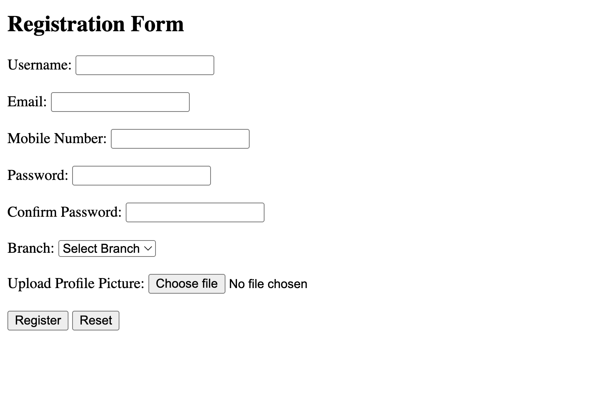
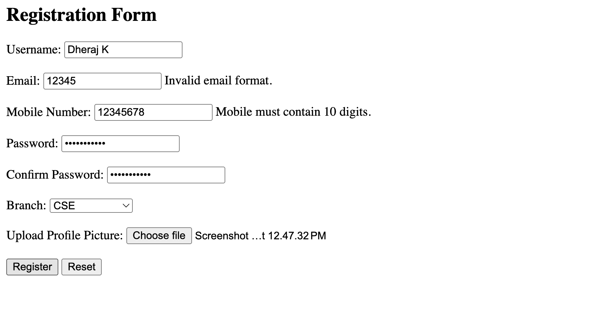
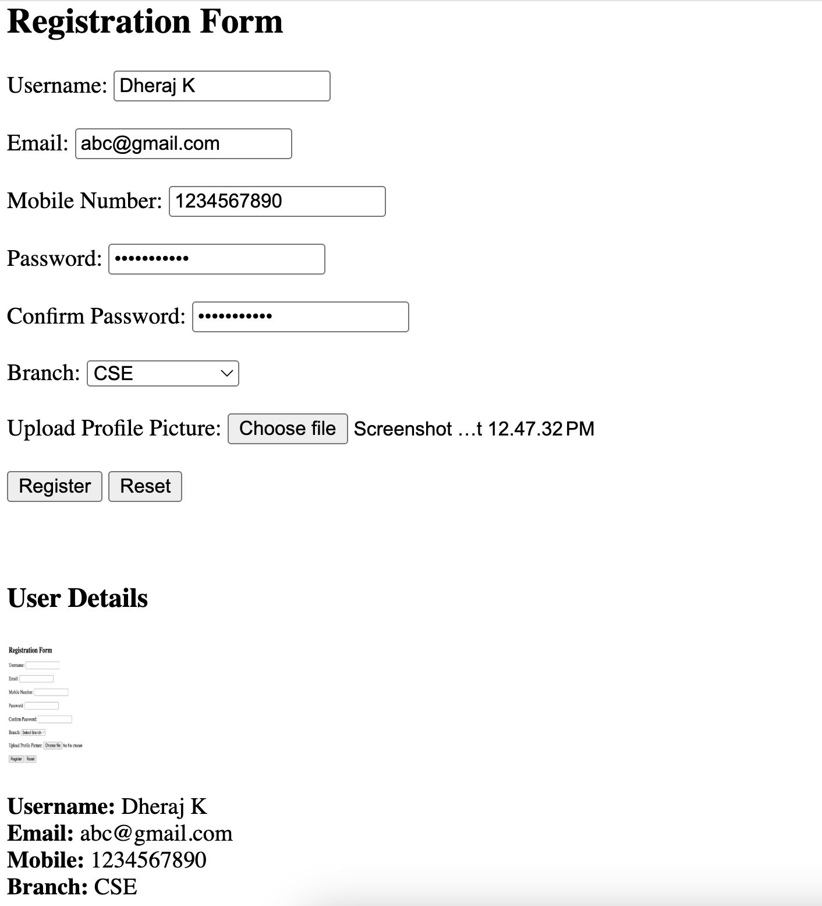

# Lab Cycle – Experiment 22

## Aim:

Design a registration form using HTML and JavaScript that:

1. Collects Username, Email, Mobile Number, Password, Confirm Password, Branch (dropdown), Profile Picture, and Register/Reset buttons.
2. Validates each field with appropriate rules and shows error messages next to each field.
3. After successful validation, displays the user details in a formatted card using DOM elements (including the uploaded profile picture).[^1][^2][^3][^4]

***

***

## Source Code

```html
<!DOCTYPE html>
<html>
<head>
    <title>Registration Form</title>
</head>
<body>

<h2>Registration Form</h2>

<form id="regForm">

    Username: 
    <input type="text" id="username">
    <span id="uError"></span><br><br>

    Email:
    <input type="text" id="email">
    <span id="eError"></span><br><br>

    Mobile Number:
    <input type="text" id="mobile">
    <span id="mError"></span><br><br>

    Password:
    <input type="password" id="password">
    <span id="pError"></span><br><br>

    Confirm Password:
    <input type="password" id="confirmPassword">
    <span id="cError"></span><br><br>

    Branch:
    <select id="branch">
        <option value="">Select Branch</option>
        <option value="CSE">CSE</option>
        <option value="ECE">ECE</option>
        <option value="MECH">MECH</option>
        <option value="CIVIL">CIVIL</option>
    </select>
    <span id="bError"></span><br><br>

    Upload Profile Picture:
    <input type="file" id="photo">
    <span id="photoError"></span><br><br>

    <button type="button" onclick="validateForm()">Register</button>
    <button type="reset">Reset</button>

</form>

<br><br>

<div id="result"></div>

<script>

function validateForm() {

    // Getting form values
    let username = document.getElementById("username").value;
    let email = document.getElementById("email").value;
    let mobile = document.getElementById("mobile").value;
    let password = document.getElementById("password").value;
    let confirmPassword = document.getElementById("confirmPassword").value;
    let branch = document.getElementById("branch").value;
    let photo = document.getElementById("photo").files[0];

    // Clearing old error messages
    document.getElementById("uError").innerHTML = "";
    document.getElementById("eError").innerHTML = "";
    document.getElementById("mError").innerHTML = "";
    document.getElementById("pError").innerHTML = "";
    document.getElementById("cError").innerHTML = "";
    document.getElementById("bError").innerHTML = "";
    document.getElementById("photoError").innerHTML = "";

    let valid = true;

    // Username validation
    if (username.length < 6) {
        document.getElementById("uError").innerHTML = "Username must be at least 6 characters.";
        valid = false;
    }

    // Email validation
    let emailPattern = /^[^ ]+@[^ ]+\.[a-z]{2,3}$/;
    if (!email.match(emailPattern)) {
        document.getElementById("eError").innerHTML = "Invalid email format.";
        valid = false;
    }

    // Mobile number validation
    if (!/^\d{10}$/.test(mobile)) {
        document.getElementById("mError").innerHTML = "Mobile must contain 10 digits.";
        valid = false;
    }

    // Password validation
    let passPattern = /^(?=.*[A-Za-z])(?=.*\d).+$/;
    if (!password.match(passPattern)) {
        document.getElementById("pError").innerHTML = "Password must include letters and numbers.";
        valid = false;
    }

    // Confirm Password
    if (password !== confirmPassword) {
        document.getElementById("cError").innerHTML = "Passwords do not match.";
        valid = false;
    }

    // Branch selection
    if (branch === "") {
        document.getElementById("bError").innerHTML = "Please select a branch.";
        valid = false;
    }

    // Photo validation
    if (!photo) {
        document.getElementById("photoError").innerHTML = "Please upload a photo.";
        valid = false;
    }

    // If validation fails → stop
    if (!valid) return;

    // If validation succeeds → display user card
    let reader = new FileReader();

    reader.onload = function(e) {
        document.getElementById("result").innerHTML = `
            <h3>User Details</h3>
            <div>
                <br>
                <strong>Username:</strong> ${username}<br>
                <strong>Email:</strong> ${email}<br>
                <strong>Mobile:</strong> ${mobile}<br>
                <strong>Branch:</strong> ${branch}<br>
            </div>
        `;
    };

    reader.readAsDataURL(photo);
}

</script>

</body>
</html>

```


***

## Output

- Registration form with all input fields, dropdown, file upload, and Register/Reset buttons.
  

- Error messages displayed next to fields when invalid data is entered (e.g., short username, wrong email, invalid mobile, weak password, mismatched confirm password, no branch/photo).

- After successful validation, user details and uploaded profile picture displayed in a simple card created using DOM elements.

***

## Explanation

- JavaScript validates each field using string length checks and regular expressions for email, mobile number, and password composition.[^2][^4][^5][^6][^1]
- Error messages are shown by setting the `innerHTML` of `<span>` elements placed next to each input, so the user immediately sees which field is incorrect.

```
- When all validations pass, a `FileReader` object converts the uploaded image to a data URL, and the script injects an `` and text details into the `result` `<div>`, forming a simple user card dynamically.[^3][^7][^8]
```

<div align="center">⁂</div>

[^1]: https://www.geeksforgeeks.org/javascript/how-to-validate-form-using-regular-expression-in-javascript/

[^2]: https://www.w3schools.com/js/js_validation.asp

[^3]: https://udn.realityripple.com/docs/Web/API/FileReader/readAsDataURL

[^4]: https://code.tutsplus.com/form-input-validation-using-only-html5-and-regex--cms-33095t

[^5]: https://www.scaler.com/topics/javascript-validate-mobile-number/

[^6]: https://www.mailercheck.com/articles/email-validation-javascript

[^7]: https://developer.mozilla.org/en-US/docs/Web/API/FileReader/readAsDataURL

[^8]: https://www.hendriklammers.com/notes/use-filereader-to-preview-an-image

