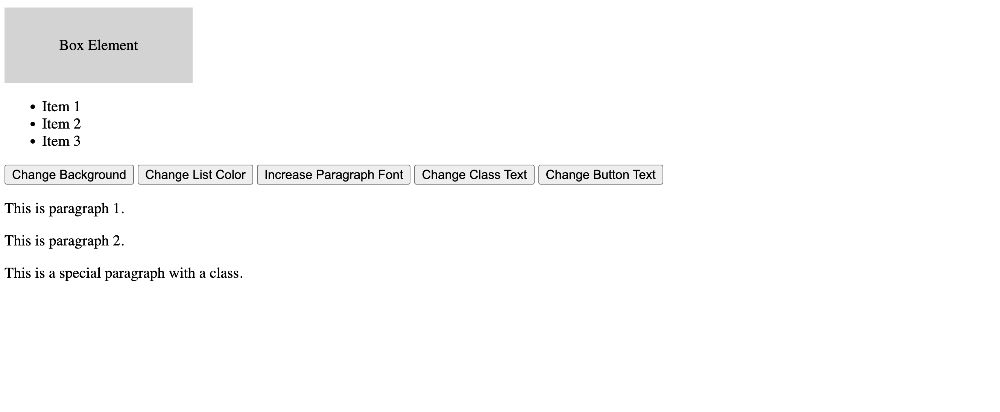
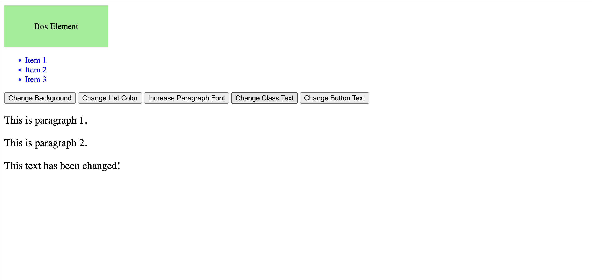

# Lab Cycle – Experiment 7

## Aim:

1. Create an HTML page with a list of items, a few buttons, and some paragraphs.
2. Using JavaScript:
a) Change the background color of an element by its id.
b) Change the text color of all list items (`<li>`) to blue.
c) Change the text of all buttons to `"Clicked!"` when clicked.
d) Increase the font size of all paragraphs.
e) Select the first element with a specific class and change its text.

***

***

## Source Code

```html
<!DOCTYPE html>
<html>
<head>
    <title>Experiment 7</title>
    <style>
        /* Styling for the box element */
        #Box {
            width: 200px;
            height: 80px;
            background: lightgray;
            text-align: center;
            line-height: 80px;
            margin-bottom: 20px;
        }
    </style>
</head>
<body>

    <!-- A box element whose background color will be changed -->
    <div id="Box">Box Element</div>

    <!-- A simple list of items -->
    <ul>
        <li>Item 1</li>
        <li>Item 2</li>
        <li>Item 3</li>
    </ul>

    <!-- Buttons to trigger different JavaScript functions -->
    <button onclick="changeBackground()">Change Background</button>
    <button onclick="changeListColor()">Change List Color</button>
    <button onclick="increaseParagraphFont()">Increase Paragraph Font</button>
    <button onclick="changeClassText()">Change Class Text</button>
    <button onclick="changeButtonText()">Change Button Text</button>

    <!-- Paragraphs to demonstrate font size change -->
    <p>This is paragraph 1.</p>
    <p>This is paragraph 2.</p>
    <p class="special">This is a special paragraph with a class.</p>

    <script>
        // a) Change the background color of an element by its ID
        function changeBackground() {
            document.getElementById("Box").style.backgroundColor = "lightgreen";
        }

        // b) Change the text color of all <li> elements to blue
        function changeListColor() {
            let items = document.getElementsByTagName("li");
            for (let i = 0; i < items.length; i++) {
                items[i].style.color = "blue";
            }
        }

        // c) Change the text of all buttons to "Clicked!" when clicked
        function changeButtonText() {
            let buttons = document.getElementsByTagName("button");
            for (let i = 0; i < buttons.length; i++) {
                buttons[i].innerText = "Clicked!";
            }
        }

        // d) Increase the font size of all paragraphs
        function increaseParagraphFont() {
            let paragraphs = document.getElementsByTagName("p");
            for (let i = 0; i < paragraphs.length; i++) {
                paragraphs[i].style.fontSize = "20px";
            }
        }

        // e) Select the first element with a specific class and change its text
        function changeClassText() {
            let element = document.querySelector(".special");
            if (element) {
                element.innerText = "This text has been changed!";
            }
        }
    </script>

</body>
</html>
```


***

---
### Output
1. Initial Screen
   
2. After you click on all the buttons
   
3. After change button text is clicked
   


## Explanation

- `getElementById("Box")` selects the `<div>` and changes its `backgroundColor`, satisfying part (a).
- `getElementsByTagName("li")` loops through all list items and sets `style.color = "blue"` for part (b).
- `getElementsByTagName("button")` changes every button’s `innerText` to `"Clicked!"` for part (c).
- `getElementsByTagName("p")` is used to increase `fontSize` of all paragraphs for part (d).
- `querySelector(".special")` selects the first element with class `special` and modifies its text for part (e).

